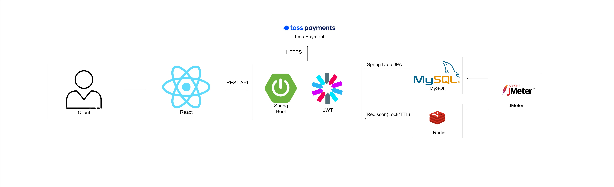

# Ticksy - 사이드 풀스택  프로젝트

> 공연 /콘서트 티켓을 실시간 좌석 선점 방식으로 예매하는 플랫폼

## 프로젝트 소개

### 서비스 설명
Ticksy는 공연 및 콘서트 티켓을 온라인으로 예매할 수 있는 플랫폼입니다. <br>
사용자는 공연을 검색하고, 좌석 배치도에서 원하는 좌석을 직접 선택한 후 Toss Payments로 결제할 수 있습니다.

### 개발 배경
이전 프로젝트인 Bid&Buy에서 DB 비관적 락으로 동시성을 제어했지만,
트래픽이 몰릴수록 DB 부하가 선형적으로 증가하는 한계를 경험했습니다. <br>
"실제 티켓팅 서비스는 어떻게 수천 명의 동시 요청을 처리할까?"라는 질문에서 시작해,
Redis 분산 락 기반 좌석 선점과 실결제 연동까지 직접 구현했습니다.

### 개발기간

2026.05.9 ~ 2026.08.22


### 해결하고자 한 문제
1. **좌석 중복 선점 (Race Condition):** 동일 좌석에 대한 동시 결제/선점 요청 시 데이터 부정합 발생 문제 해결
2. **Database 커넥션 병목:** 대량의 좌석 상태 조회 및 락 획득 시 발생하던 DB Connection Timeout 방지
3. **결제 이중 호출 및 부정 결제:** 클라이언트 상태 불일치, React StrictMode 렌더링 이슈, 결제 금액 위변조 위험 차단


## 🛠 Tech Stack
### Backend
       

### Frontend
    

### Database
 

### Infra


## 🏗 아키텍처 및 ERD


### 아키텍처 구성도




### ERD
[링크](https://www.erdcloud.com/d/Yzguo7ihDa2M5aWQR)


## ✨ 주요 기능

<details>
  <summary>주요 기능</summary>

### 회원
- 이메일 인증 후 회원가입 (Redis에 인증번호 TTL 5분 저장)
- 일반 로그인 + JWT (Access 30분 / Refresh 7일)
- Access Token 재발급 / 로그아웃
- 비밀번호 변경 (변경 후 자동 로그아웃)
- 회원 탈퇴 (확정 예매 존재 시 불가)

### 공연
- 공연 목록 조회 (날짜/지역 필터, 페이지네이션)
- 공연 검색 (공연명 또는 출연진 키워드)
- 공연 상세 조회 (회차 목록, 등급별 가격, 잔여석)

### 좌석 선점
- 구역별 좌석 배치도 조회 (AVAILABLE / HOLDING / RESERVED)
- 좌석 선점 요청 (Redisson 분산 락 + TTL 5분, 최대 4석)
- 좌석 선점 취소 (Redis 즉시 삭제)
- 선점 만료 자동 해제 (TTL 만료)

### 예매/결제
- 예매 정보 확인 (선점 좌석 + 금액)
- Toss Payments 결제 요청/승인/실패
- 예매 취소 + 환불 정책
  - 공연 7일 전 이상: 전액 환불
  - 3~7일 전: 70% 환불
  - 3일 이내: 취소 불가

### 마이페이지
- 예매 내역 조회 / 상세 조회
- 예매 취소 신청
- 
</details>


## 🔥 트러블슈팅

[1. 좌석 선점 동시성](troubleshooting/Race.md) <br>
[2. 결제 중복 호출](troubleshooting/Payment.md)<br>
[3. 좌석 배치도 조회시 성능 저하](troubleshooting/Seat.md)

## 📄 API Docs
- Swagger 링크 또는 대표 API 목록

## 🚀 Getting Started
- 실행 방법
- 환경 변수

## 📁 Project Structure

```
Ticksy/
├── backend/
│   └── src/main/java/com/Ticksy/backend/
│       ├── domain/
│       │   ├── concert/         # 공연 도메인
│       │   ├── seat/            # 좌석 도메인
│       │   ├── reservation/     # 예매 도메인
│       │   ├── payment/         # 결제 도메인
│       │   └── user/            # 회원 도메인
│       └── global/
│           ├── config/          # Security, Redis, Swagger 설정
│           ├── exception/       # 공통 예외 처리
│           └── response/        # 공통 응답 형식
│
└── frontend/
    └── src/
        ├── api/                 # Axios 인스턴스 + API 함수
        ├── components/          # Header, PrivateRoute
        ├── pages/
        │   ├── auth/            # 로그인, 회원가입, 마이페이지
        │   ├── concert/         # 공연 목록, 상세
        │   ├── seat/            # 좌석 배치도
        │   ├── reservation/     # 예매 정보 확인
        │   └── payment/         # 결제, 완료, 실패
        ├── store/               # Zustand 상태관리
        └── types/               # TypeScript 타입 정의
```


 