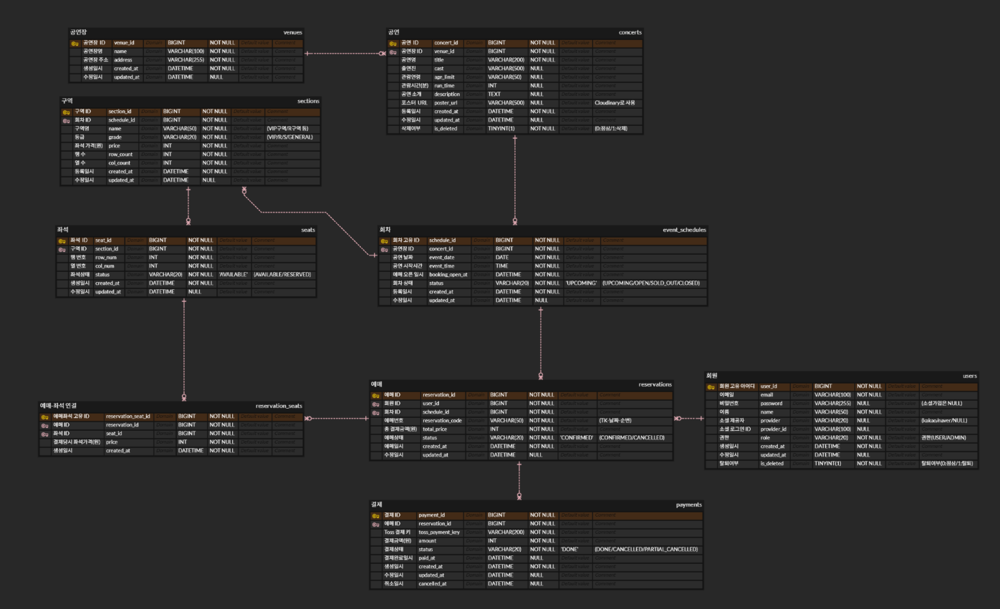

# Ticksy 

콘서트 티켓 플랫폼

## 프로젝트 소개

'Ticksy'는 트래픽이 집중되는 콘서트/공연 환경에서 **실시간 좌석 선점**과 **안정적인 결제 프로세스**를 제공하는 티켓 예매 플랫폼입니다. <br>
사용자는 실시간 좌석 배치도를 확인하여 원하는 좌석을 5분간 임시 선점할 수 있으며, Toss Payments 연동을 통해 결제 및 예매 확정까지 단절 없는 흐름으로 진행됩니다.

## 개발기간

2026.05.9 ~ 2026.08.22


### 해결하고자 한 문제
1. **좌석 중복 선점 (Race Condition):** 동일 좌석에 대한 동시 결제/선점 요청 시 데이터 부정합 발생 문제 해결
2. **Database 커넥션 병목:** 대량의 좌석 상태 조회 및 락 획득 시 발생하던 DB Connection Timeout 방지
3. **결제 이중 호출 및 부정 결제:** 클라이언트 상태 불일치, React StrictMode 렌더링 이슈, 결제 금액 위변조 위험 차단

## 🔥 핵심 기술적 도전
| 번호 | 문제 상황 (Problem) | 핵심 원인 (Cause) | 해결 방법 (Solution) | 상세 보기 |
| :---: | :--- | :--- | :--- | :---: |
| **01** | 결제 성공 후 승인 실패 에러 표출 | React StrictMode 이중 마운트 | `useRef` 단일 실행 제어 | [📄 상세보기](./docs/troubleshooting/01-payment-strictmode.md) |
| **02** | 동시 좌석 예약 시 중복 선점 발생 | Race Condition | Redisson 분산 락 적용 | [📄 상세보기](./docs/troubleshooting/02-redisson-lock.md) |

## 🛠 Tech Stack
### Backend
       

### Frontend
    

### Database
 

### Infra


### Test
 

## 🏗 아키텍처 및 ERD

<details>

<summary>아키텍처</summary>

- 흐름 설명 (이미지 없으면 텍스트)
</details>

<br>

<details>

<summary>ERD</summary>

[링크](https://www.erdcloud.com/d/Yzguo7ihDa2M5aWQR)


</details>

## ✨ 주요 기능
- 공연 목록/검색/상세 조회
- 좌석 배치도 조회 (DB + Redis 조합)
- 좌석 선점 (Redisson 분산 락 + TTL 5분)
- Toss Payments 결제 / 예매 취소 + 환불
- JWT 인증 (Access/Refresh Token)

## ⚡ Performance Optimization
### Before (문제 상황)
### 구조 개선 (방식1 - 구역별 분리 조회)
### After (개선 결과)
### 인덱스 적용 전/후 수치 비교 표

## 🔥 트러블슈팅
### 1. React StrictMode 결제 중복 호출

- **문제 상황:**
  Toss Payments 결제 성공 후 승인 결과 페이지(`PaymentCompletePage`) 진입 시 DB에는 예매 정보(`reservation`), 결제 내역(`payment`), 좌석(`reservation_seat`) 데이터가 정상 저장되었으나, 화면상에는 *"결제 승인에 실패했습니다. 고객센터에 문의해주세요"*라는 에러 메시지가 출력되는 현상 발생.

- **원인 분석:**
    1. 개발 환경의 `React.StrictMode`로 인해 컴포넌트 마운트 시 `useEffect` 내 결제 승인 API(`confirmPayment`)가 연속 **2회 호출**됨.
    2. **1차 요청:** 백엔드에서 Toss Payments 승인 완료 및 DB 저장 수행 후, Redis 내 임시 주문 정보(`orderRedisService.deleteOrderInfo(orderId)`) 삭제 완료.
    3. **2차 요청:** 이미 Redis에서 주문 정보가 삭제되었거나 Toss API 측에 승인 완료된 `orderId`로 재요청이 들어가 백엔드에서 예외(`PAYMENT_CONFIRM_FAILED`)가 발생하고, 이 응답이 최종 프론트 State에 반영되어 에러 화면 표출.

- **해결 방안:**
    - **프론트엔드 중복 요청 차단:** `useEffect` 내부에 `useRef` 플래그(`calledRef`)를 도입하여 컴포넌트 라이프사이클 내 승인 API 호출이 단 **1회만 수행**되도록 제어.

```typescript
// PaymentCompletePage.tsx
const calledRef = useRef(false);

useEffect(() => {
  // React.StrictMode에 의한 2번째 실행 차단
  if (calledRef.current) return;
  calledRef.current = true;

  const paymentKey = searchParams.get('paymentKey');
  const orderId = searchParams.get('orderId');
  const amount = searchParams.get('amount');

  if (paymentKey && orderId && amount) {
    handleConfirm(paymentKey, orderId, Number(amount));
  }
}, []);
```

### 7. Toss orderId 불일치

## 📄 API Docs
- Swagger 링크 또는 대표 API 목록

## 🚀 Getting Started
- 실행 방법
- 환경 변수

## 📁 Project Structure

```java

Ticksy/
├── frontend/ (React 19 + TypeScript + Zustand)
│   └── src/
│       ├── api/               -- Axios 인스턴스 및 Domain별 API 호출
│       │   ├── auth.ts        -- 인증 API
│       │   ├── axios.ts       -- Axios 기본 설정
│       │   ├── concert.ts     -- 공연 API
│       │   ├── reservation.ts -- 예매 API
│       │   └── seat.ts        -- 좌석 API
│       ├── components/        -- 공통 레이아웃 & 라우터 컴포넌트
│       │   ├── Header.tsx
│       │   └── PrivateRoute.tsx
│       ├── pages/             -- 화면 단위 페이지 컴포넌트
│       │   ├── auth/          -- 로그인 / 회원가입
│       │   ├── concert/       -- 공연 목록 / 상세 조회
│       │   ├── payment/       -- 결제 / 결제 완료
│       │   ├── reservation/   -- 예매 내역 및 상태 조회
│       │   └── seat/          -- 실시간 좌석 배치도
│       ├── store/             -- Zustand 글로벌 상태 관리
│       │   └── authStore.ts
│       └── types/             -- TypeScript DTO/Interface 정의
│           ├── concert.ts
│           ├── reservation.ts
│           └── seat.ts
│
└── backend/ (Spring Boot 4.0 + Java 21)
    └── src/main/
        ├── java/com/Ticksy/backend/
        │   ├── domain/            -- 도메인 중심 계층 구조 (Domain-Driven)
        │   │   ├── user/          -- 회원 / 인증
        │   │   ├── concert/       -- 공연 정보 및 스케줄 조회
        │   │   ├── seat/          -- 좌석 배치 및 선점 상태
        │   │   ├── reservation/   -- 예매 프로세스
        │   │   └── payment/       -- Toss Payments 결제
        │   └── global/            -- 공통 인프라 및 글로벌 설정
        │       ├── config/        -- Security, Redis, Swagger, RestTemplate 등
        │       ├── auth/          -- JWT Filter / Provider
        │       ├── exception/     -- GlobalExceptionHandler 및 에러 코드
        │       └── response/      -- 공통 API Response Wrapper
        └── resources/
            └── application.yml
```