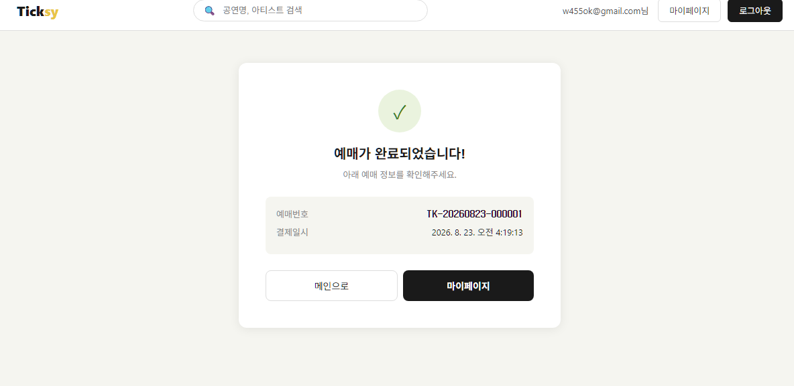

# 2. React StrictMode 결제 중복 호출

## 문제상황

Toss Payments 결제 완료 후 `/payment/complete` 페이지로 리다이렉트될 때, 해당 페이지에서 호출하는 `POST /payments/confirm` 결제 승인 API가 연속 2회 호출되는 현상이 발생했습니다.  
이로 인해 외부 결제사 승인 요청 중복 및 DB에 예매/결제 데이터가 중복 삽입되는 문제가 발생했습니다.

```
결제 완료 → /payment/complete 진입
    → confirmPayment 1번 호출 → 예매 저장 성공
    → confirmPayment 2번 호출 → 예매 중복 삽입 또는 에러
```

## 원인

React StrictMode가 개발 환경에서 `useEffect`를 의도적으로 2번 실행했습니다.

```tsx
// PaymentCompletePage.tsx
useEffect(() => {
  handleConfirm(paymentKey, orderId, Number(amount)); // 2번 실행됨
}, []);
```

결제 승인 API(confirmPayment)는 Toss 서버에 외부 API를 호출하고
DB에 예매/결제 데이터를 저장하는 부수 효과(Side Effect) 가 있어,
2번 호출되면 실제로 2번 처리됩니다.

## 해결 과정

`useRef`로 첫 번째 호출 여부를 기록하여 중복 방지했습니다.

```tsx
// 수정 전 - 2번 실행됨
useEffect(() => {
  const paymentKey = searchParams.get('paymentKey');
  const orderId = searchParams.get('orderId');
  const amount = searchParams.get('amount');

  handleConfirm(paymentKey, orderId, Number(amount));
}, []);
```

```tsx
// 수정 후 - useRef로 중복 실행 방지
const calledRef = useRef(false);

useEffect(() => {
  // 이미 호출됐으면 즉시 종료
  if (calledRef.current) return;
  calledRef.current = true;

  const paymentKey = searchParams.get('paymentKey');
  const orderId = searchParams.get('orderId');
  const amount = searchParams.get('amount');

  if (!paymentKey || !orderId || !amount) {
    setError('결제 정보가 올바르지 않습니다.');
    setLoading(false);
    return;
  }

  handleConfirm(paymentKey, orderId, Number(amount));
}, []);
```

### useRef를 선택한 이유

```
useState로 방지할 수도 있지만 useState는 상태 변경 시 리렌더링을 발생시킵니다.
따라서 useRef는 값이 변경돼도 리렌더링이 발생하지 않아 선택했습니다.
```

## 결과

결제 완료 후 `/payment/complete` 진입 시 `confirmPayment`가 정확히 1번만 호출되어  
DB에 예매/결제 데이터가 단 1건만 저장되는 것을 확인했습니다.

