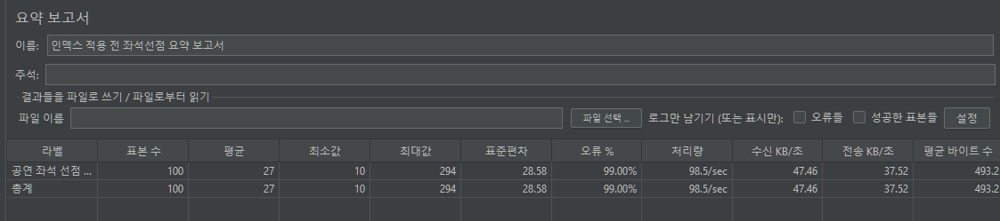

# 1. 좌석 선점 동시성 문제

## 문제 상황
동일 좌석에 100명이 동시에 선점 요청을 보낼 경우, 일반 조회-저장 방식은 Race Condition이 발생했습니다.  
A와 B가 거의 동시에 "이 좌석 비어있나?"를 확인하면 둘 다 "비어있다"고 판단해 중복 선점이 발생했습니다.

```
A 요청: "1행 1열 비어있나?" → 비어있음 확인
B 요청: "1행 1열 비어있나?" → 비어있음 확인  ← A가 저장하기 전에 확인
A 요청: Redis에 선점 저장
B 요청: Redis에 선점 저장  ← 중복 선점 발생
```

## 원인

Redis의 `SET` + `GET` 조합은 원자적이지 않습니다.  
두 요청이 거의 동시에 "선점 여부 확인"을 하면, 둘 다 "비어있다"고 판단해 선점에 성공합니다.  
결과적으로 **하나의 좌석에 두 명이 동시에 선점**되는 상황이 발생합니다.

## 해결 과정 

이전 프로젝트 Bid&Buy에서 DB 비관적 락을 사용했을 때 트래픽이 늘수록
DB 부하가 선형적으로 증가하는 한계를 경험했습니다. <br>
Redisson은 인메모리 기반이라 DB 부하 없이 빠르게 처리할 수 있어 선택했습니다.

Redisson의 `RLock`을 좌석 단위로 적용해, 한 번에 한 요청만 선점 로직을 수행하도록 설계했습니다.

### Redis 키 설계
```
  선점 키: seat:hold:{scheduleId}:{seatId} → userId (TTL 5분)
  락 키: lock:seat:{scheduleId}:{seatId} → Redisson RLock
```
### 좌석 선점 코드
```java
public boolean tryHoldSeat(Long scheduleId, Long seatId, Long userId) {
    String lockKey = LOCK_PREFIX + scheduleId + ":" + seatId;
    RLock lock = redissonClient.getLock(lockKey);

    try {
        // 락 획득 시도 (대기 3초, 점유 3초)
        boolean acquired = lock.tryLock(3, 3, TimeUnit.SECONDS);

        if (!acquired) {
            return false; // 락 획득 실패 → 선점 실패
        }

        // 락 획득 성공 → 이미 선점됐는지 확인
        String holdKey = SEAT_HOLD_PREFIX + scheduleId + ":" + seatId;
        if (Boolean.TRUE.equals(redisTemplate.hasKey(holdKey))) {
            return false; // 이미 선점됨
        }

        // 선점 처리 (TTL 5분)
        redisTemplate.opsForValue().set(holdKey, String.valueOf(userId), 5, TimeUnit.MINUTES);
        return true;

    } catch (InterruptedException e) {
        Thread.currentThread().interrupt();
        throw new CustomException(ErrorCode.INTERNAL_SERVER_ERROR);
    } finally {
        if (lock.isHeldByCurrentThread()) {
            lock.unlock(); // 반드시 해제
        }
    }
}
```

### 좌석 상태 판단 로직

```java
public static SeatItemResponse of(SeatEntity seat, boolean isHolding) {
    String status;
    if (seat.getStatus().name().equals("RESERVED")) {
        status = "RESERVED";   // DB 기준 - 예매 완료
    } else if (isHolding) {
        status = "HOLDING";    // Redis 기준 - 선점 중 (TTL 5분)
    } else {
        status = "AVAILABLE";  // 선택 가능
    }
    return SeatItemResponse.builder()
            .seatId(seat.getSeatId())
            .rowNum(seat.getRowNum())
            .colNum(seat.getColNum())
            .status(status)
            .build();
}
```
### 선점 흐름

```
100명 동시 요청
    ↓
Redisson RLock 획득 시도 (좌석 단위)
    ↓
락 획득 성공 (1명만)
    ├── Redis holdKey 존재 확인
    ├── 없으면 → 선점 저장 (TTL 5분) → 성공
    └── 있으면 → 즉시 실패 반환

락 획득 실패 (99명)
    └── 즉시 실패 반환 → ALREADY_HELD_SEAT
```

## 결과

JMeter 100명 동시 선점 요청 시 1명만 성공, 99명이 `ALREADY_HELD_SEAT` 에러 수신  
에러율 99%는 분산 락 정상 동작을 했습니다.

