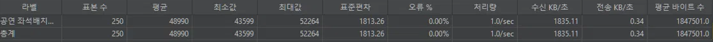
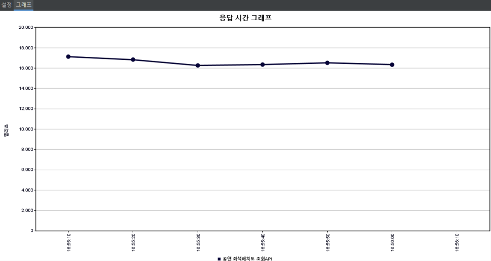
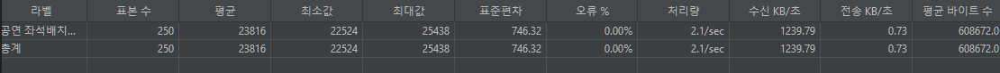
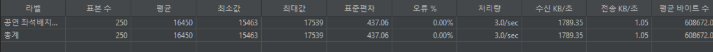

# 좌석 배치도 조회 성능 저하 문제

## 문제 상황

좌석 배치도 조회 시 한 회차의 **전체 좌석(30,000석)을 한 번에 반환**하는 구조였습니다.  
JMeter 250 요청(50 스레드 × 5회) 기준 평균 응답시간이 **48,990ms(약 48.9초)** 로 측정됐습니다.



## 원인

병목 지점이 2개였습니다.

**1. DB Full Scan**  
인덱스 없이 30,000건을 `section_id` 기준으로 조회하면 `seats` 테이블 전체를 스캔합니다.

**2. JSON 직렬화 비용**  
Spring이 30,000개의 `SeatItemResponse` 객체를 JSON으로 직렬화하는 데 걸리는 시간이 응답 지연의 주 원인이었습니다.

```
30,000석 조회 → JSON 직렬화 10,000건 → 응답 전송
→ 평균 48,990ms
```

인덱스만 추가해서는 직렬화 비용을 줄일 수 없어 구조적 개선이 필요했습니다.

## 해결 과정

### 1단계 — 구역별 분리 조회 적용

실제 티켓팅 서비스(인터파크, 멜론티켓)와 동일하게  
**사용자가 구역 탭을 클릭할 때 해당 구역 좌석만 조회**하는 방식으로 변경했습니다.

```
변경 전: GET /seats → 전체 30,000석 반환
변경 후: GET /seats?sectionId=1 → A구역 10,000석만 반환
```

**백엔드 — SeatController**

```java
// sectionId 파라미터 추가
@GetMapping("/api/concerts/{concertId}/schedules/{scheduleId}/seats")
public ResponseEntity<ApiResponse<SeatLayoutResponse>> getSeatLayout(
        @PathVariable Long concertId,
        @PathVariable Long scheduleId,
        @RequestParam(required = false) Long sectionId  // 추가
) {
    return ResponseEntity.ok(
            ApiResponse.success(
                    seatService.getSeatLayout(concertId, scheduleId, sectionId)
            )
    );
}
```

**백엔드 — SeatService**

```java
public SeatLayoutResponse getSeatLayout(Long concertId, Long scheduleId, Long sectionId) {

    EventScheduleEntity schedule = eventScheduleRepository
            .findByScheduleIdAndConcert_ConcertId(scheduleId, concertId)
            .orElseThrow(() -> new CustomException(ErrorCode.NOT_FOUND_SCHEDULE));

    List<SectionEntity> sections;

    if (sectionId != null) {
        // 방식1: 특정 구역만 조회
        sections = sectionRepository.findWithSeatsBySectionId(scheduleId, sectionId);
    } else {
        // 하위 호환: 전체 구역 조회
        sections = sectionRepository.findWithSeatsByScheduleId(scheduleId);
    }

    // 탭 목록은 좌석 없이 구역 정보만 조회
    List<SectionEntity> allSections = sectionRepository.findBySchedule_ScheduleId(scheduleId);

    return SeatLayoutResponse.builder()
            .scheduleId(scheduleId)
            .bookingOpenAt(schedule.getBookingOpenAt())
            .sections(toSectionResponses(scheduleId, sections))
            .allSections(toTabResponses(allSections))
            .build();
}
```

**백엔드 — SectionRepository**

```java
// 특정 구역 + 좌석 fetch join
@Query("SELECT s FROM SectionEntity s " +
       "JOIN FETCH s.seats " +
       "WHERE s.schedule.scheduleId = :scheduleId " +
       "AND s.sectionId = :sectionId")
List<SectionEntity> findWithSeatsBySectionId(
        @Param("scheduleId") Long scheduleId,
        @Param("sectionId") Long sectionId);

// 탭용 구역 목록 (좌석 없이)
List<SectionEntity> findBySchedule_ScheduleId(Long scheduleId);
```

**프론트 — SeatPage.tsx**

```typescript
// 탭 클릭 시 해당 구역 API 재호출
const handleTabClick = async (sectionId: number) => {
  setSelectedSectionId(sectionId);
  setSelectedSeatIds([]);
  await fetchSectionSeats(sectionId); // sectionId 파라미터로 API 호출
};

const fetchSectionSeats = async (sectionId: number) => {
  const data = await getSeatLayout(concertId!, Number(scheduleId), sectionId);
  if (data.sections.length > 0) {
    setSelectedSection(data.sections[0]);
  }
  setLayout(data);
};
```

### 2단계 — 인덱스 추가

구역별 분리 조회 후에도 10,000건 조회가 여전히 느려 인덱스를 추가했습니다.

```sql
-- 좌석 배치도 조회 핵심 인덱스
CREATE INDEX idx_section_id ON seats(section_id);
CREATE INDEX idx_schedule_id ON sections(schedule_id);

-- 공연 목록 조회
CREATE INDEX idx_concert_id ON event_schedules(concert_id);
CREATE INDEX idx_venue_id ON concerts(venue_id);

-- 예매/결제 조회
CREATE INDEX idx_user_id ON reservations(user_id);
CREATE INDEX idx_res_schedule_id ON reservations(schedule_id);
CREATE INDEX idx_reservation_id ON payments(reservation_id);
```

---

## 결과

### 성능 개선 흐름



| 단계                        | 평균 응답시간  | 개선율      |
|---------------------------|----------|----------|
| 방식1 전 (30,000석)           | 48,990ms       | 기준       |
| 방식1 적용 인덱스 적용 전 (10,000석) | 23,179ms | 약   52.7% 개선     |
| 방식1 후 인덱스 적용 후 (10,000석)  | 16,450ms | 약 29% 개선 |

### 인덱스 전/후 비교

**좌석 배치도 조회**

#### 인덱스 적용 전


#### 인덱스 적용 후



| 인덱스 전    | 인덱스 후 |
|----------|-|
| 23,179ms |  16,450ms |
| **개선율**  | **약 29% 개선** |

### 전체 개선 요약

```
48,990ms (방식1 전)
    ↓  구역별 분리 조회 적용 (52.7% 개선)
23,179ms (방식1 후, 인덱스 전)
    ↓  인덱스 추가 (29% 추가 개선)
16,450ms (방식1 후, 인덱스 후)

최종: 48,990ms → 16,450ms (약 66.4% 개선)
```

